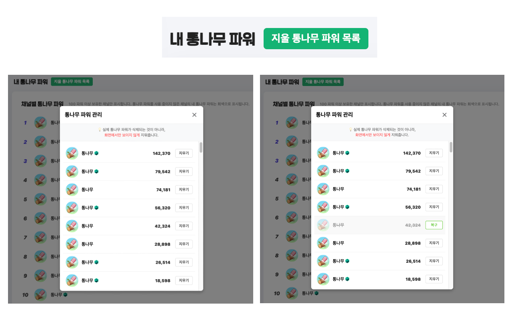

# 🪵 통나무 파워 지우개 - 치지직 통나무 파워 목록 정리

**내 통나무 파워 목록, 이제 깔끔하게 정리하세요!**

수많은 스트리머의 통나무 파워가 쌓여 목록이 지저분해 보였나요?
**'통나무 파워 지우개'**는 치지직 프로필의 '내 통나무 파워' 목록에서 더 이상 보고 싶지 않은 채널을 손쉽게 숨길 수 있는 확장 프로그램입니다. 이제 클릭 한 번으로 나만의 목록을 깔끔하게 관리해 보세요.

  

> 💡 **참고:** 실제로 획득한 통나무 파워 데이터가 삭제되는 것이 아니라, **화면에서만 보이지 않게 숨겨주는** 안전한 기능입니다.

---

## ✨ 주요 기능

- 🧹 **간편한 숨김 처리**
  - 프로필 페이지에 추가된 '지울 통나무 파워 목록' 버튼을 클릭하면 관리 팝업창이 열립니다.
  - 목록에서 '지우기' 버튼만 누르면 해당 채널이 즉시 화면에서 사라집니다.

- ♻️ **자유로운 복구**
  - 실수로 지웠거나 다시 보고 싶으신가요? 팝업창에서 '복구' 버튼을 누르면 언제든지 원래 상태로 되돌릴 수 있습니다.

- 💾 **브라우저 저장 기능**
  - 숨김 처리한 내역은 브라우저에 안전하게 저장됩니다. 페이지를 새로고침하거나 브라우저를 껐다 켜도 사용자가 설정한 상태가 그대로 유지됩니다.

- 🚀 **쾌적한 사용성 (UX)**
  - **스켈레톤 UI 적용**: 데이터를 불러오는 동안 깜빡임 없이 부드러운 화면 전환을 제공합니다.
  - **실시간 반영**: 팝업창에서 설정을 변경하면 뒷배경의 실제 페이지 목록에도 즉시 반영되어 직관적으로 확인할 수 있습니다.
  - **자동 업데이트 알림**: 확장 프로그램이 업데이트되면 상단 배너를 통해 알려주어, 항상 최신 기능을 놓치지 않고 사용할 수 있습니다.

---

## 🔄 업데이트 방법

자동으로 업데이트가 되지 않는다면, 사용 중인 브라우저의 확장 프로그램 관리 페이지에 접속하여 상단의 **'업데이트'** 버튼을 클릭하세요.

- **Chrome**: `chrome://extensions/`
- **Edge**: `edge://extensions/`
- **Whale**: `whale://extensions/`
- **Firefox**: `about:addons` 페이지 상단 톱니바퀴 > '업데이트 확인'

---

본 확장 프로그램은 치지직과 관련이 없으며, 네이버, 치지직, CHZZK은 NAVER㈜의 등록상표입니다. 본 확장 프로그램을 사용하여 발생하는 결과에 대한 모든 책임은 사용자에게 있습니다.
